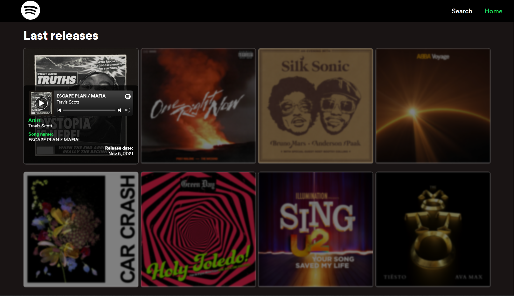
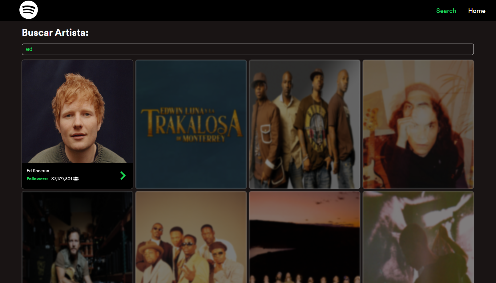
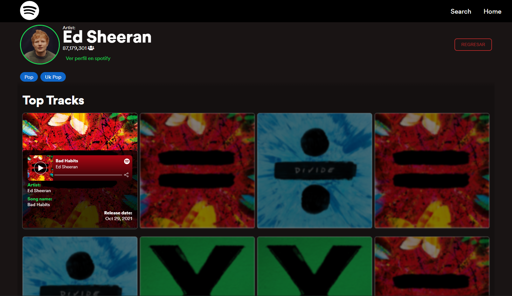
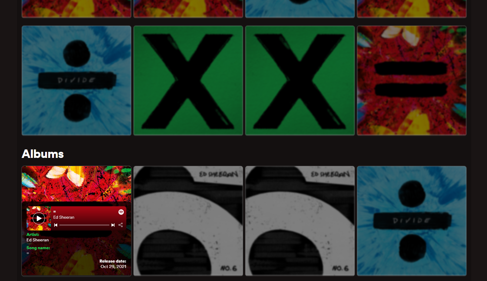
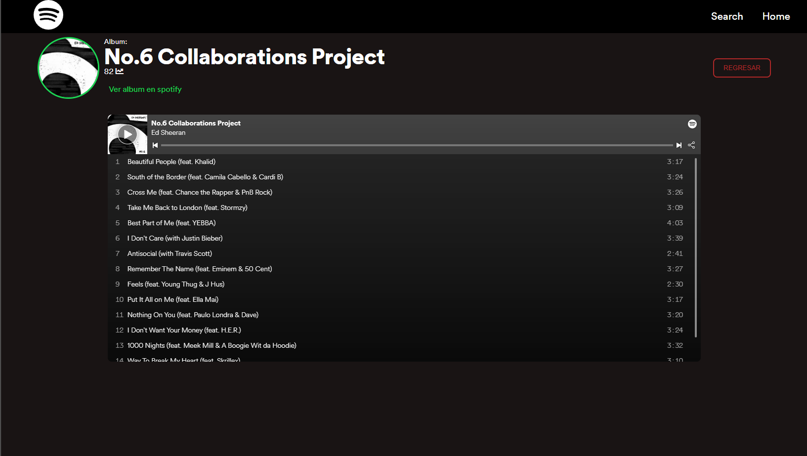

# SpotiPreview

This project was generated with [Angular CLI](https://github.com/angular/angular-cli) version 12.0.4.

## Preview

### Home page

### Search page

### Artist profile

### Album page

## Intall dependencies
Run `npm install` to download all dependencies referring to package.json

## Development server

Run `ng serve` for a dev server. Navigate to `http://localhost:4200/`. The app will automatically reload if you change any of the source files.

## Build

Run `ng build` to build the project. The build artifacts will be stored in the `dist/` directory.
